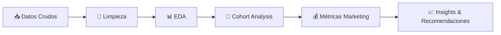

# 📊 Proyecto Showz: Optimización de Marketing Analytics

### *Análisis de LTV, CAC, ROMI y Rentabilidad de Canales de Adquisición*

---

## 🎯 Contexto del Proyecto

**Showz** es una plataforma de venta de entradas para eventos que invierte en marketing digital para adquirir usuarios. El desafío principal es entender:

- ¿Qué canales y dispositivos traen clientes **rentables**?
- ¿En cuánto tiempo se **recupera la inversión**?
- ¿Dónde optimizar el **presupuesto de marketing**?

---

## 🚀 Finalidad del Proyecto

Evaluar la **eficiencia del gasto en marketing** y proponer acciones estratégicas para **mejorar rentabilidad y crecimiento sostenible**.

### Objetivos Principales

✅ Analizar el embudo completo: **Visitas → Compras**  
✅ Medir métricas clave: **CAC**, **LTV**, **ROMI** por cohortes  
✅ Identificar diferencias por **fuente de adquisición** y **dispositivo**  
✅ Determinar el **payback period** y proponer optimizaciones accionables

---

## 📁 Datos Utilizados

| Dataset | Descripción |
|---------|-------------|
| `visits` | Sesiones de usuarios: fecha/hora, dispositivo, fuente de adquisición |
| `orders` | Transacciones: compras realizadas e ingresos generados |
| `costs` | Inversión en marketing por fuente y fecha |

---

## 🔬 Metodología

### Proceso de Análisis

1. **Limpieza y preparación**: Estandarización de fechas, usuarios y unificación de tablas
2. **Análisis exploratorio**:
   - Estacionalidad de visitas y compras
   - Ticket promedio (AOV)
   - Patrones temporales y anomalías
3. **Cohort Analysis**:
   - Cohortes por mes de primera compra
   - Cálculo de LTV acumulado
   - Evolución del valor por usuario en el tiempo
4. **Métricas de Marketing**:
   - CAC por cohorte/fuente
   - Comparación CAC vs LTV
   - ROMI por cohortes y estimación de payback

---

## 💡 Conclusiones Clave

### 🎯 Hallazgos Principales

| Métrica | Resultado | Interpretación |
|---------|-----------|----------------|
| **ROMI** | >100% en mes 5-6 | ✅ La inversión se recupera en mediano plazo |
| **CAC vs LTV** | 9.94 vs 43.02 | ✅ Adquisición rentable (LTV 4.3x mayor que CAC) |
| **Payback** | ~5-6 meses | ⏱️ Tiempo razonable de recuperación |

### 📱 Rendimiento por Dispositivo

- 🖥️ **Desktop**: Mejor desempeño, mayor conversión
- 📱 **Touch/Mobile**: Oportunidad de optimización

### 📢 Rendimiento por Fuente de Adquisición

| Categoría | Sources | Acción Recomendada |
|-----------|---------|-------------------|
| ✅ **Alto ROI** | 3, 4, 5 | 📈 Aumentar inversión |
| ❌ **Bajo ROI** | 1, 2, 9, 10 | 📉 Reducir o pausar |

### 🔑 Insights Estratégicos

> 💰 **El valor del cliente se construye con el tiempo**: La primera compra puede ser rápida, pero la rentabilidad real depende de **retención y recurrencia**.

> ⚠️ **Regla de oro**: Si el CAC se mantiene alto pero el LTV cae, la inversión no se justifica.

---

## 🎯 Recomendaciones Accionables

### 1️⃣ Optimización de Presupuesto
- 🔄 **Reasignar** inversión desde fuentes 1, 2, 9, 10 → hacia 3, 4, 5
- 📊 Implementar **reglas automáticas** de pausa/activación según CAC/LTV

### 2️⃣ Mejora de Experiencia Mobile
- 📱 Optimizar **UX en Touch**: checkout, velocidad, reducción de fricción
- 🎨 A/B testing en flujos de conversión mobile

### 3️⃣ Estrategias de Retención
- 📧 Email marketing y remarketing
- 🎁 Programas de fidelización y cross-sell
- 🔁 Campañas de reactivación

### 4️⃣ Dashboard de Monitoreo
Implementar seguimiento mensual con:
- 📊 Visitas, conversión, AOV
- 💰 CAC, LTV, ROMI por cohorte/fuente/dispositivo
- ⏱️ Payback estimado por canal

---

## 🛠️ Tecnologías y Herramientas

| Categoría | Tecnologías |
|-----------|-------------|
| **Lenguaje** | Python 3.x |
| **Análisis de Datos** | Pandas, NumPy |
| **Visualización** | Matplotlib, Seaborn |
| **Metodología** | Cohort Analysis, Marketing Analytics |
| **Métricas** | CAC, LTV, ROMI, AOV, Payback Period |

---

## 📊 Visualizaciones Destacadas

- 📈 Evolución temporal de visitas y compras
- 🔥 Heatmap de cohortes (LTV acumulado)
- 💰 Comparativa CAC vs LTV por fuente
- 📱 Performance por dispositivo
- 🎯 ROMI por canal de adquisición

